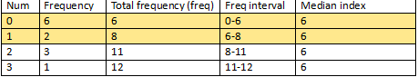

# [Median Frequency Explaination](https://leetcode.com/problems/find-median-given-frequency-of-numbers/discuss/102712/Simple-solution-NO-join-ONE-subquery)

So in general, the median's frequency should be equal or grater than the absolute difference of its bigger elements and small ones in an array no matter whether it has odd or even amount of numbers and whether they are distinct. This rule is the key, and it is represented as the following code.

```
SUM(CASE
    WHEN Employee.Salary = alias.Salary THEN 1
    ELSE 0
END) >= ABS(SUM(SIGN(Employee.Salary - alias.Salary)))
```

The **SIGN()** function returns the sign of a number.

This function will return one of the following:
* If number > 0, it returns 1
* If number = 0, it returns 0
* If number < 0, it returns -1


[Frequency Interval Explaination](https://leetcode.com/problems/find-median-given-frequency-of-numbers/discuss/681337/Super-Simple-5-Lines)

The natural index of the median should be within the range of frequency intervals of each value. 

For Example:


